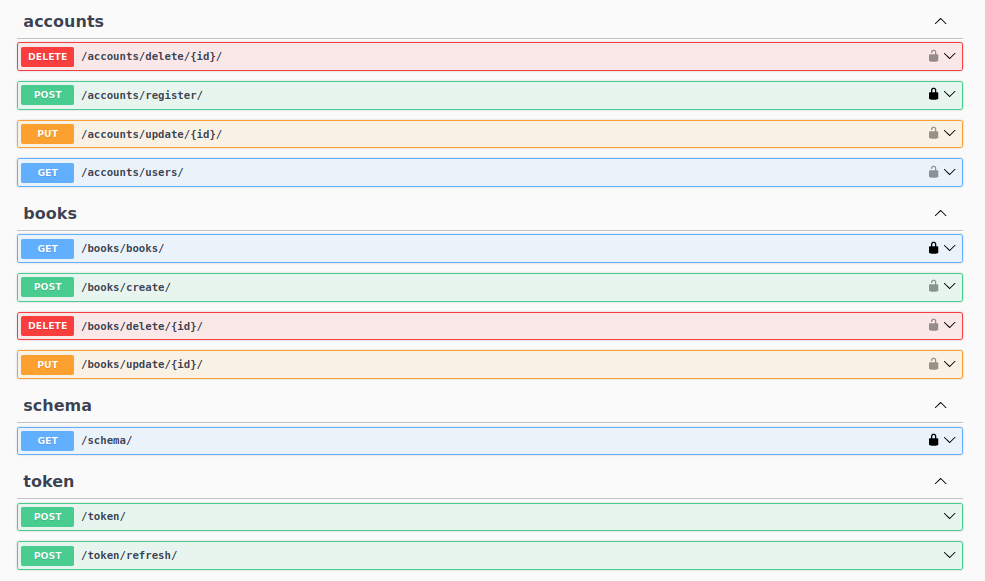

# library-api-with-django

#### a restful api with django

#### i used django rest framework with postgresql database and dockerize everything.

## API Schema



## How to setup
```
pip install -r requirements.txt
```

```
python manage.py runserver
```
